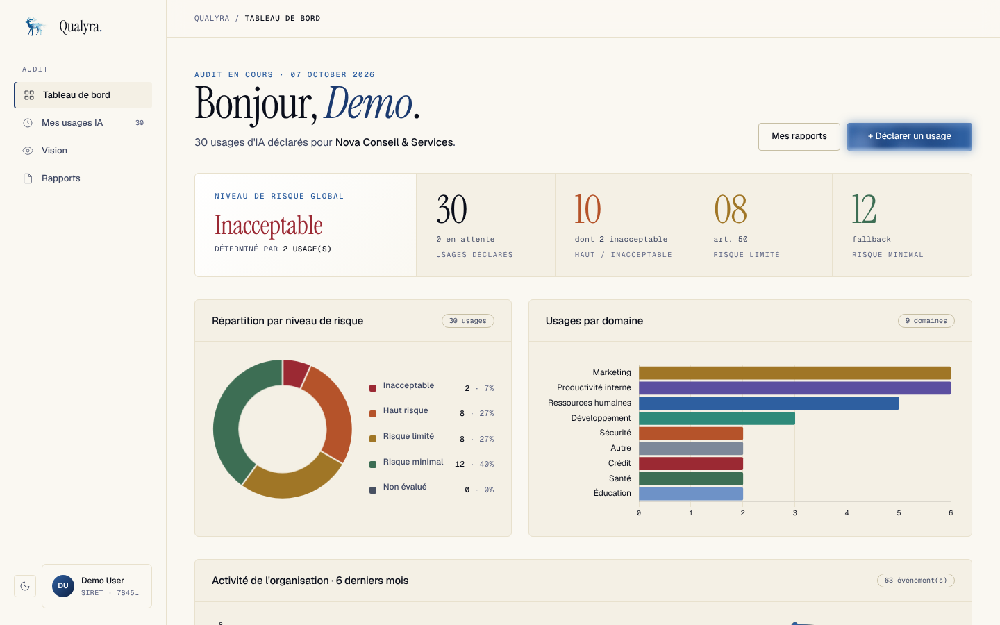
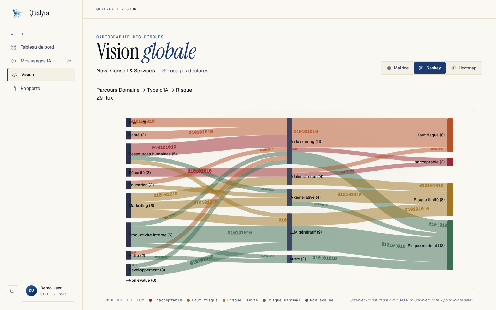
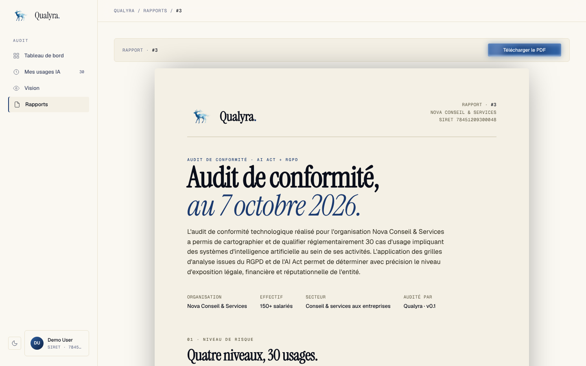
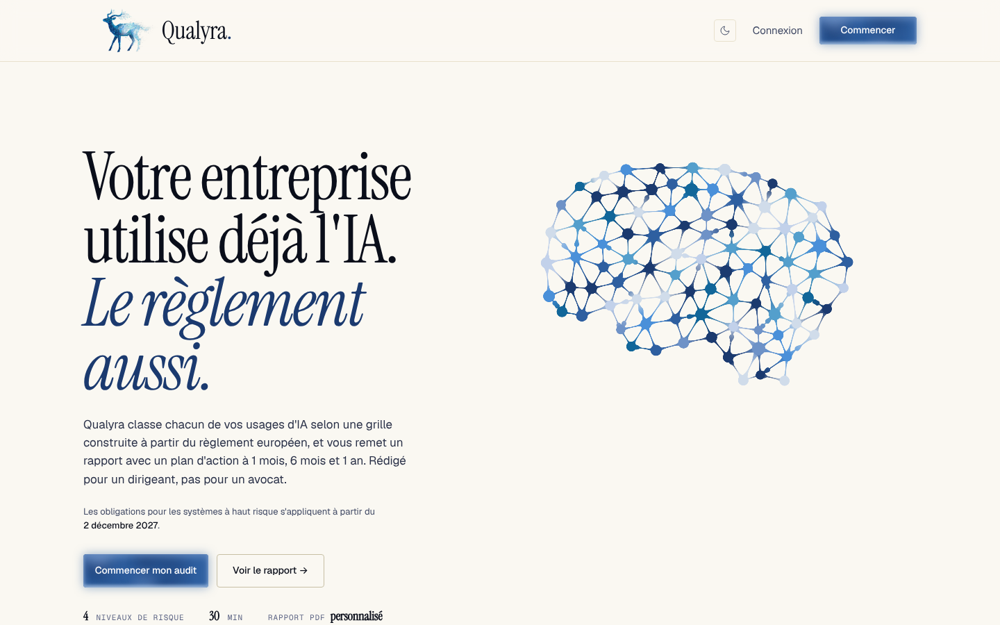

<p align="center">
  
</p>

<h1 align="center">Qualyra</h1>

<p align="center">
  <strong>Votre entreprise utilise déjà l'IA. Le règlement européen aussi.</strong><br>
  L'audit AI Act + RGPD pensé pour les PME qui n'ont ni DPO, ni RSSI, ni 30 000 € pour un cabinet.
</p>

<p align="center">
  <a href="https://github.com/tomtimlt/qualyra/actions/workflows/tests.yml"></a>
  <a href="LICENSE"></a>
  
  <a href="https://www.php.net/releases/8.4/"></a>
  <a href="https://laravel.com"></a>
</p>

<p align="center">
  <a href="#-le-problème">Le problème</a> ·
  <a href="#-ce-que-fait-qualyra">Ce que fait Qualyra</a> ·
  <a href="#-essayer-en-1-minute">Essayer</a> ·
  <a href="#-lhistoire-du-projet">L'histoire</a> ·
  <a href="#-contribuer">Contribuer</a>
</p>

<p align="center">
  
</p>

> [!WARNING]
> **Qualyra est un outil d'aide au diagnostic, pas un conseil juridique.**
> La classification repose sur les déclarations de l'utilisateur et sur une lecture du Règlement (UE) 2024/1689 et du RGPD à une date donnée. Elle peut être incomplète ou dépassée. Faites valider toute décision de conformité par un avocat ou un DPO. Logiciel fourni « en l'état », sans garantie ([LICENSE](LICENSE)).

---

## 🎯 Le problème

Une PME de 50 personnes utilise aujourd'hui ChatGPT pour rédiger, un outil qui trie les CV, un chatbot sur son site, peut-être un scoring client. **Personne ne sait lesquels de ces usages tombent sous le coup de l'AI Act**, ni ce qu'il faut faire.

| | |
|---|---|
| ⚖️ **35 M€ ou 7 % du CA mondial** | Sanction maximale pour une pratique d'IA interdite |
| 📅 **Déjà en vigueur** | Pratiques interdites depuis le 2 février 2025, transparence (Art. 50) depuis le 2 août 2026 |
| ⏳ **2 décembre 2027** | Obligations des systèmes à haut risque (recrutement, crédit, éducation…) |
| 💸 **10 à 50 k€** | Prix d'un accompagnement par un cabinet, hors de portée de la plupart des PME |

## ✨ Ce que fait Qualyra

```
  Déclarer ses usages d'IA  →  Répondre à un questionnaire  →  Classement automatique  →  Rapport PDF + plan d'action
      (ChatGPT, tri de CV…)        (adapté à chaque usage)        (4 niveaux AI Act)          (1 mois · 6 mois · 1 an)
```

- 🧠 **Un moteur de 22 règles** qui traduit le règlement en logique : 8 pratiques interdites, 8 cas à haut risque, 6 obligations de transparence.
- 🗓️ **Un moteur qui connaît le calendrier** : chaque règle a sa date d'entrée en vigueur, et l'outil montre ce qui va basculer dans 1 et 2 ans. Calendrier à jour du **Digital Omnibus** (juillet 2026).
- 🔐 **Le RGPD en parallèle** : base légale, transferts hors UE, sous-traitants, avec un suivi des fournisseurs d'IA (OpenAI, Anthropic, Mistral…).
- 📄 **Un rapport lisible par un dirigeant** : synthèse, détail par usage, plan d'action, checklist, zones grises. Le contenu est figé à la génération pour garder une trace.
- 🏢 **Multi-organisations** avec isolation stricte des données entre clients.

### En images

| Cartographie des risques | Rapport de conformité |
|---|---|
|  |  |

<p align="center">
  
</p>

### Les 4 niveaux de risque

| Niveau | Exemples | Depuis / à partir du | Sanction max |
|---|---|---|---|
| 🔴 **Inacceptable** | Notation sociale, reconnaissance d'émotions au travail, manipulation | 02/02/2025 | 35 M€ ou 7 % CA |
| 🟠 **Haut risque** (Annexe III) | Tri de CV, scoring crédit, éducation, biométrie | 02/12/2027 | 15 M€ ou 3 % CA |
| 🟠 **Haut risque** (Annexe I) | IA intégrée à un dispositif médical, une machine | 02/08/2028 | 15 M€ ou 3 % CA |
| 🟡 **Risque limité** (Art. 50) | Chatbots, deepfakes, contenus générés | 02/08/2026 | 15 M€ ou 3 % CA |
| 🟢 **Risque minimal** | Le reste | Aucune obligation | — |

Les dates du haut risque tiennent compte du **Digital Omnibus sur l'IA** (en vigueur le 27/07/2026), qui a repoussé les échéances initiales du 02/08/2026 et du 02/08/2027.

## 🚀 Essayer en 1 minute

Il faut seulement Docker :

```bash
git clone https://github.com/tomtimlt/qualyra.git && cd qualyra
docker build -t qualyra . && docker run -d -p 8000:8000 qualyra
```

Ouvrez **http://localhost:8000** et connectez-vous avec **`demo@example.com`** / **`password`**. Le compte démo contient une PME fictive (Nova Conseil & Services) avec 30 usages d'IA déjà déclarés et des rapports générés.

<details>
<summary><strong>Installation sans Docker</strong></summary>

Prérequis : PHP 8.4, Composer 2, Node 20+.

```bash
composer install
npm install && npm run build
cp .env.example .env && php artisan key:generate
touch database/database.sqlite
php artisan migrate --seed
composer dev   # serveur + queue + logs + Vite
```

Le rendu PDF utilise Chrome headless. Si Chromium n'est pas dans `/usr/bin/chromium`, renseignez `CHROME_PATH` dans `.env`.

</details>

## 📖 L'histoire du projet

Qualyra est né d'un constat simple : l'AI Act arrive et les PME françaises n'ont ni les compétences juridiques en interne, ni le budget pour un cabinet. J'ai voulu leur donner une réponse concrète, sous forme d'un rapport à environ 1 500 € au lieu de plusieurs dizaines de milliers.

J'ai conçu et développé le produit seul : lecture du règlement, traduction en règles testables, application web, rapport PDF, paiement. Le projet commercial n'a pas abouti. **Plutôt que de le laisser dormir, je le publie en open source** pour que le moteur de règles et la démarche servent à d'autres : développeurs, DPO, consultants GRC, étudiants.

Si vous travaillez sur la conformité IA, vos retours m'intéressent, en particulier pour me dire où une règle est fausse.

## 🛠️ Sous le capot

| | |
|---|---|
| **Back** | PHP 8.4 · Laravel 13 · SQLite / MySQL |
| **Front** | Blade · Alpine.js · Tailwind CSS 4 · Vite |
| **PDF** | Browsershot (Chrome headless) |
| **Paiement** | Stripe Checkout (optionnel) |
| **Qualité** | 136 tests Pest · Pint · CI GitHub Actions · Dependabot |
| **Déploiement** | Docker, image autonome |

Le cœur du projet tient en quelques fichiers :

- [`config/ai_act_rules.php`](config/ai_act_rules.php) : les 22 règles, chacune avec sa condition, son article de référence et sa date d'application.
- [`app/Services/AiActClassifier.php`](app/Services/AiActClassifier.php) : le moteur : les règles sont évaluées par ordre de sévérité et la première qui correspond l'emporte (`INACCEPTABLE > HAUT_RISQUE > RISQUE_LIMITE > DEFAULT`).
- [`app/Services/ComplianceTimelineBuilder.php`](app/Services/ComplianceTimelineBuilder.php) : la projection à 1 et 2 ans.

<details>
<summary><strong>Documentation technique détaillée</strong></summary>

### Architecture

```
app/
├── Http/Controllers/   # CRUD usages, questionnaire, assessment, report, checkout
├── Services/           # AiActClassifier, ReportContentBuilder, ReportSnapshotBuilder
├── Models/             # User, Organization, AiUsage, Response, Assessment, Report
└── Policies/           # AiUsagePolicy (isolation tenant)

config/
├── ai_act_rules.php       # 22 règles AI Act (matrice officielle)
├── questionnaire.php      # Questions dynamiques par type/domaine
└── report_templates.php   # Templates rédactionnels du rapport

resources/views/
├── reports/pdf.blade.php  # Template PDF standalone (Chrome headless)
└── questionnaire/         # Formulaire dynamique
```

Plus de détails : [`docs/ARCHITECTURE.md`](docs/ARCHITECTURE.md) · [`docs/DB_SCHEMA.md`](docs/DB_SCHEMA.md).


### Génération PDF

Le projet utilise **spatie/browsershot** (headless Chrome/Chromium via Puppeteer) pour générer des PDF identiques au rendu web, contrairement à DomPDF qui ne supporte ni flexbox ni les variables CSS.

- Template standalone dans `resources/views/reports/pdf.blade.php`
- Logo embarqué en base64
- Détection automatique du navigateur (Chrome sur macOS, Chromium sur Linux/Docker)
- Sections : couverture, synthèse exécutive, détail par usage, plan d'action 1 mois / 6 mois / 1 an, checklist, zones grises, disclaimer


### Docker

### Image autonome

Le `Dockerfile` build une image self-contained avec tout le nécessaire :

- PHP 8.4 + extensions (pdo_sqlite, gd, intl, bcmath, zip, exif)
- Node.js 20 + Chromium (pour le rendu PDF)
- Dépendances Composer installées au build (`--no-dev`)
- Assets frontend compilés (Vite build)

### docker-compose.yml

Pour le développement avec bind mount et volumes persistants (`vendor`, `node_modules`).

### entrypoint.sh

Au démarrage du conteneur :
1. Crée `.env` depuis `.env.example` si absent
2. Génère `APP_KEY`
3. Installe les dépendances si les volumes sont vides (fallback dev)
4. Crée la base SQLite, migrations, seed (uniquement si base vierge)
5. Démarre `php artisan serve`


### Configuration Stripe

Le paiement Stripe est optionnel. En l'absence de `STRIPE_SECRET`, les rapports sont générés gratuitement.

```env
# Activation du paiement
STRIPE_SECRET=sk_test_...
STRIPE_CURRENCY=eur
STRIPE_REPORT_PRICE=4900     # 49 € en centimes
```


### Tests

Le projet est couvert par une suite [Pest 4](https://pestphp.com) (136 tests), exécutée par la CI GitHub Actions à chaque push et pull request, avec Pint pour le style.

```bash
php artisan test                    # toute la suite
php artisan test --filter Report    # par filtre
php artisan test --parallel         # parallélisé
```

Les tests de téléchargement PDF lancent un vrai Chrome headless. Si Chromium n'est pas dans `/usr/bin/chromium`, indiquez son chemin : `CHROME_PATH=/chemin/vers/chrome php artisan test`.

| Module | Couverture |
|--------|------------|
| AiUsage | CRUD + 4 vecteurs IDOR (isolation tenant) |
| Questionnaire | Questions dynamiques, persistence, upsert, validation |
| Assessment | Classification 4 niveaux, alertes, isolation |
| Matrice AI Act | 5 scénarios Annexe III (tests de cohérence) |
| Report | Checkout, snapshot, PDF, contenus conditionnels |
| Auth | Breeze (par défaut) |


### Sécurité

- **Isolation tenant stricte** — `AiUsagePolicy` + contrainte `user_id` UNIQUE sur `organizations`
- **Snapshot figé** — le rapport stocke un JSON immuable au moment de la génération (valeur juridique opposable)
- **Pas de mass assignment** — les FK sont injectées via les relations Eloquent
- **Validation centralisée** — Form Requests typés, aucune validation inline dans les controllers
- **CSRF** — natif Laravel sur tous les formulaires
- **Audit dépendances** — Dependabot configuré sur Composer, npm, GitHub Actions

Signalement de vulnérabilité : voir [`SECURITY.md`](SECURITY.md).


### Conventions

- Langue : français (commentaires, textes UI, documentation)
- Modèles : singulier (`AiUsage`) — Tables : pluriel (`ai_usages`)
- PHP : `declare(strict_types=1)` partout
- Tests : Pest 4 avec helper functions (`userWithOrgAndUsage()`, `usageWithAnswers()`)


### Documentation

| Fichier | Public | Description |
|---------|--------|-------------|
| [`CONTRIBUTING.md`](CONTRIBUTING.md) | Devs | Workflow Git, conventions de commit, checklist PR |
| [`SECURITY.md`](SECURITY.md) | Tous | Politique de signalement de vulnérabilités |
| [`CHANGELOG.md`](CHANGELOG.md) | Tous | Historique des versions (format Keep a Changelog) |
| [`docs/ARCHITECTURE.md`](docs/ARCHITECTURE.md) | Devs | Architecture détaillée et décisions techniques |
| [`docs/DB_SCHEMA.md`](docs/DB_SCHEMA.md) | Devs | Schéma de base de données |
| [`docs/Guide de Conformité AI Act.md`](docs/Guide%20de%20Conformité%20AI%20Act.md) | Métier | Référentiel AI Act exhaustif |
| [`docs/Matrices et Référentiels d'Audit.md`](docs/Matrices%20et%20Référentiels%20d'Audit.md) | Métier | Matrices opérationnelles d'audit |

</details>

## 🤝 Contribuer

Les contributions sont bienvenues, surtout sur l'exactitude réglementaire : une règle mal encodée, une date dépassée ou une zone grise mal décrite sont des bugs à part entière.

- Un bug ou une idée : ouvrez une [issue](https://github.com/tomtimlt/qualyra/issues).
- Une correction : ouvrez directement une pull request (voir [CONTRIBUTING.md](CONTRIBUTING.md)).
- Une faille de sécurité : suivez [SECURITY.md](SECURITY.md).

Si le projet vous est utile, une ⭐ aide à le faire connaître.

## 📜 Licence

© 2026 Thomas Lhostete, distribué sous licence **[GNU AGPL-3.0](LICENSE)**.

Vous pouvez utiliser, modifier et redistribuer Qualyra librement. Si vous le proposez comme service en ligne, vous devez publier le code source de votre version sous la même licence. Les rapports générés ne constituent pas un avis juridique.

---

<p align="center">
  Conçu pour les PME françaises par <a href="https://github.com/tomtimlt">@tomtimlt</a> · CESI Nancy<br>
  <sub>Contact : thomas.lhostete@viacesi.fr</sub>
</p>
